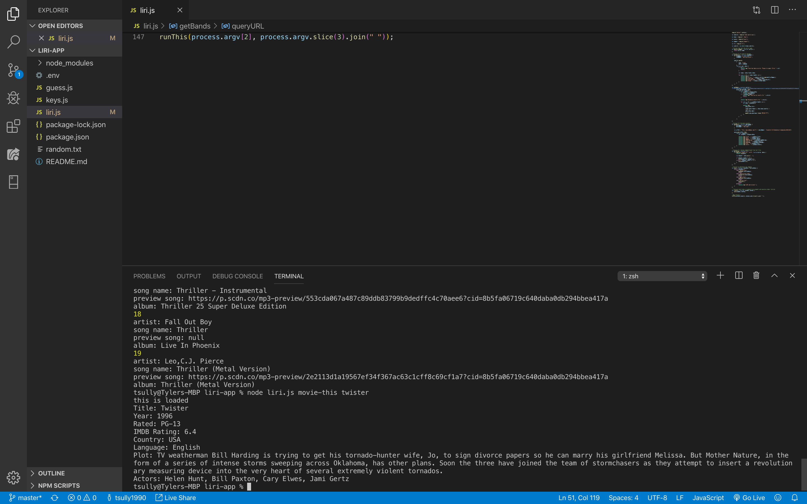
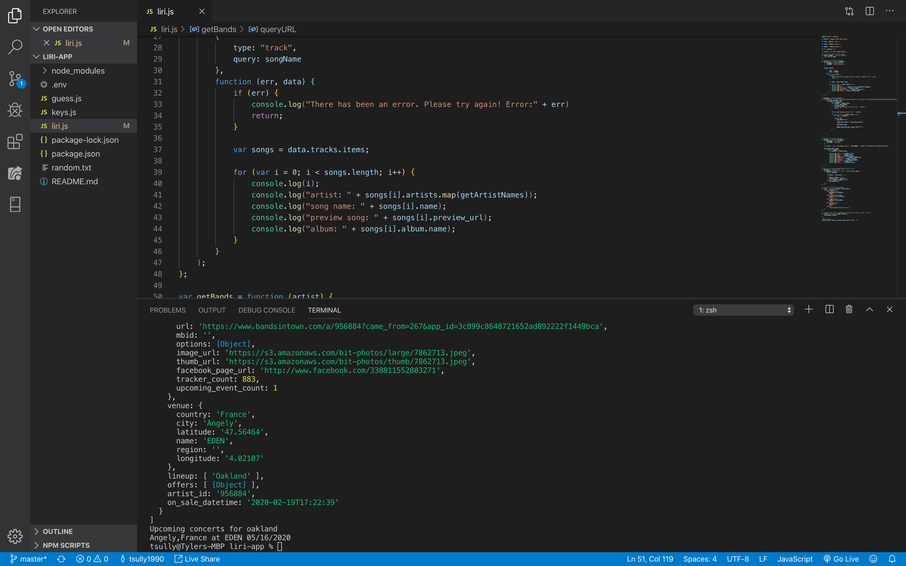
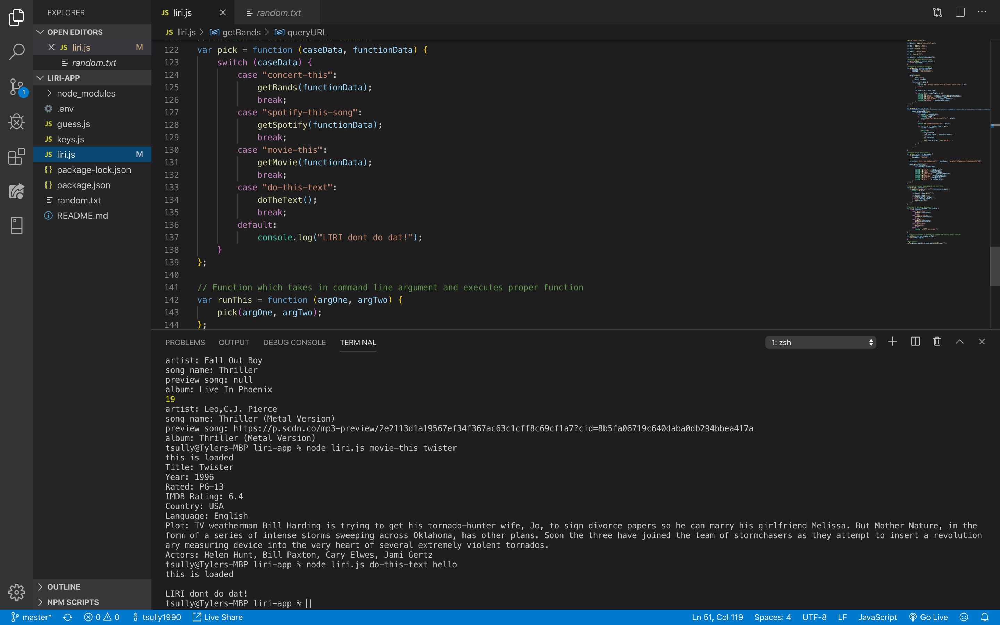
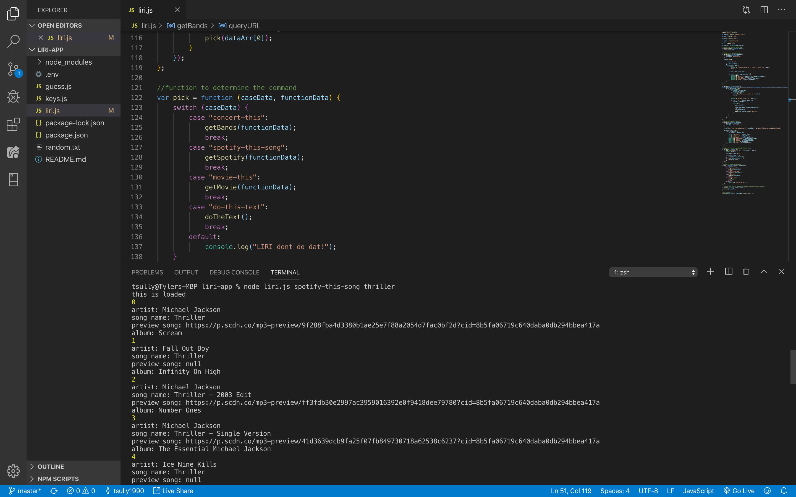

# liri-app
this is my liri app of node.js

Liri is an app that helps the client find song, movie and concert information that thyre curious about. Liri was built using Node.js and in a backend app.

A screenshot of my app using an ajax call to retrieve movie data that the user requested.

A screenshot of my app using an ajax call to retrieve concert information based on the location that was put in by the client.

A screenshot of my app applying text to a text file from the terminal.

A screenshot of my app using an ajax call to retrieve song information from Spotify
